<h1 align="center" style="margin-top: 1em; margin-bottom: 3em;">
</h1>
<h2 align="center" style= "margin-top: 1em; margin-bottom: 3em;"> Project Title: "The New Silicon Valley: 
 
Why Miami is the New Hotspot for Tech Innovation." </h2> 

 
 <h4 align="center"> By: Goose0x 
 Date: August 29, 2021 </h4> 

<b>1.0 Introduction </b>

<b>1.1 Background </b>

The results of the COVID-19 pandemic have put a major strain on businesses due to government policies, paired with a rising income tax rate, and high cost-of-living.  As a result many businesses are looking for alternative places to setup, or move to.  This year we are seeing that many major key players in the tech industry are looking for alternative locations and local governments who support entrepreneurs and businesses to support the goals of the company. 

This is a major shift again in history (like the gold rush in the mid 1800's, and Silicon Valley in the early 1900s to today) now seeking less government restriction elsewhere for booming technical innovation, lower crime rate, and better living conditions.  Which could also bring in more people and money to the cities. 

For the Capstone Project I will be investigating why tech businesses are choosing to move to Miami versus staying in Silicon Valley, San Francisco Bay, CA. and Why places like Miami, FL and Austin, TX are so attractive? 

<b>1.2 Problem </b>

 
This poses a unique situation for California, adapt or lose business.  The data collected will be the average cost of living for each location, income tax and other tax for each area. Average cost of labor, and business related incentives that make comparisons of the two states.  The report will also discuss the crime rate statistics, environmental factors and attractions to include local restaurants, housing areas, etc using FourSquare API data.

  
<b> 1.3 Interest </b>

This information, compiled into a report would be beneficial for businesses looking to expand or move to alternative locations in order to maintain business in the United States and avoid high taxes, overcrowded cities, and look for suitable places their business and families can grow.  The report features a breakdown of the categories with supported documentation amd statistical analysis through tables.

  
<b>2.0 Data Acquisition and Cleaning </b>

<b>2.1 Data Sources </b>

Data for comparison was collected from a variety of sources.  At some locations it was able to be utilized as is.  For others, it would require further analysis and cleansing. 

The zipcodes geodata for [California](<https://www.geonames.org/postalcode-search.html?q=california&country=US>) and for [Florida](<https://www.geonames.org/postalcode-search.html?q=florida&country=US>). 

Cost of living data was collected here [Cost of Living Comparison](<https://www.bestplaces.net/cost-of-living/santa-clara-ca/miami-fl/250000>). 

Income Taxes and Other Taxes for [California](<https://smartasset.com/taxes/california-tax-calculator>) and for [Florida](<https://smartasset.com/taxes/florida-tax-calculator>). 

Occupational and Labor Statistics were downloaded from here [California Labor](<https://www.bls.gov/oes/current/oes_ca.htm#15-0000>) and for [Florida Labor](<https://www.bls.gov/oes/current/oes_fl.htm#15-0000>). 
 
Business Incentives for comparing the states were from here [California Business](<http://apps.csg.org/BusinessIncentives/StateProfile.aspx?id=5>) and for [Florida Business](<http://apps.csg.org/BusinessIncentives/StateProfile.aspx?id=9>). 

Crime statistics for each state were collected from here [Santa Clara County, CA](<https://www.santaclaraca.gov/our-city/departments-g-z/police-department/crime>) and from [Miami-Dade County, FL](<https://www.miamidade.gov/global/police/crime-statistics.page>).  As well as data charts sourced from [NeighborhoodScout](https://www.neighborhoodscout.com).

The FourSquare API was utilized with the geodata to create maps using Folium and k-means cluster data for analysis and comparison of neighboring towns in the Miami-Dade County.
  
 <b>2.2 Data Cleaning </b>

  
 <b>2.2.1 Geolocation Data</b>

 The geolocation data was webscraped using beautiful soup and was exported as a txt file.  The file was then compiled and cleaned  utilizing IBM Watson Studios. Compiled into this [CSV](<https://github.com/Goose0x/Coursera_Capstone/blob/master/CSV/zip_codes_cal_fl.csv>).

Initial issues with the data collection posed problems, as locating sufficient data, cleaning it, and getting the values to correctly display posed a problem when utilizing GeoLocator with Python.  Once the data had been collected, and properly formatted into a text file.
 
 The tools provided within IBM Watson Studios made the task of cleaning, organizing, removing, and sorting easy.  
 Once the data was imported, a flow was created to <i> Filter </i> only "Santa Clara" + "Miami-Dade". 

 The data then was verified and "Na" values were present in the data set under "Latitude" and "Longitude".  This was cleaned with a <i> Remove </i> operation.
 The data was verified again for any "Na" values using .isnull. 

 The dataset was then imported into the Jupyter notebook as part of the Data section, which lists the zipcodes and geo data for Santa Clara County, CA and Miami-Dade County, FL. The dataset was further broken into two dataframes, Santa Clara and Miami. This dataset was used for FourSquare's API to review local data in the Miami, FL vicinity. 

 
  <b>2.2.2 Crime Statistics Data Data</b>

 Crime statistics were collected from the their respective sources and cleaned manually before being processed in IBM Watson Studios data refining process.  The data for Santa Clara was manually edited in Excel to remove unneccessary data points, and refiltered to remove the timestamp as it was proving difficult to clean the data for presentation, and no utilitiy seemed to work while utilizing IBM Watson Studios data refining.  Once the dataset was prepared, it was reimported into IBM Watson Studios for processing.  There were 144,992 total entries.  Data was filtered using "THEFT" and "ASSAULT".  The Miami-Dade County data set was first processed in Excel, to remove unnecessary data, and move selected data "Dates" and "Miami-Dade County" to a new excel document, consisting of years 2015-2019.  Next, it was imported into IBM Watson Studios for processing.  The data sets are located [here](<https://github.com/Goose0x/Coursera_Capstone/tree/master/CSV>).

 To support the data from the crime statistics, data was also accessed from [Neighborhood Scout](<https://www.neighborhoodscout.com/>) for each city.
 
  <b>2.2.3 Labor Statistics Data</b>

 When approaching the problem initially, data was gathered for each state with the attempt to compare business costs and wage differences in the Computer Mathematics sector.  It was during the review and cleaning that the data chosen proved to be not valid for the report and was discarded after multiple attempts to filter and clean it.  Instead utilizing the website at [BLS.gov](<https://www.bls.gov/>).  A search was conducted for "San-Jose, CA" and "Miami, FL" utilizing the criteria "Computer and Mathematical Occupations".

 Utilizing these parameters data was collected and tables created to display a comparison of the data.  The files can be located [here](<https://github.com/Goose0x/Coursera_Capstone/tree/master/Images>). 

 
 <b>2.2.4 FourSquare Data</b>

 Miami venues were collected using the FourSquare API using the geodata collected.  This returned (2142, 7) results consisting of seven columns and 2142 rows of data.  Next, the dataset was groupedby "Neighborhood" and consolidated into a dataframe of 256 unique categories.  The groups were then grouped by category, and the mean was found for each value (6, 257).  The top five venues were then determined for each neighborhood, and placed in ascending order.
 
 The data was then processed using k-means to aggregate into clusters.  A new dataframe was created to include the cluster and "Top 10 Venues".  Some of the clusters proved to contain extra data that would need to be cleansed for better presentation.  However, enough was present to conclude results from the provided data.
 
 <b>3.0 Exploratory Data Analysis </b>

 
 <b>3.1 Cost of Living Comparison </b>

 When considering a new location to live many factors play into what the cost will be to live in that area.  That is why it was important to look into a comparison of the data between Santa Clara, CA and Miami, Florida.
<h1 align="center" style="margin-top: 1em; margin-bottom: 3em;">
 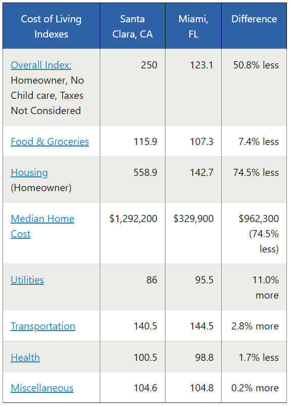</a>

</h4>

<h4 align="center" style="margin-top: 1em; margin-bottom: 3em;">
 
 Figure 1: Cost of Living Comparision for Santa Clara, CA and Miami, FL. [BestPlaces.net].
</h4>

  
 Overall we can see that there is a major difference in Housing at 74.5% less which makes up the Homeowner median housing index.  The average home in Santa Clara, CA is $1,292,200   compared to a house in Miami, FL at $329,900.  Thats a difference of over $962,300.  The other categories like Food and Grocery, Utilities, and Transportation are comparable and   are not a focus of this figure.
 

 <b>3.2 Income Taxes and Other Associated Taxes </b>
 

  Anyone who works hard wants to keep their money, and it is important to factor in what the state you are working in, is taking out from your paycheck.  The next figure compares California and Florida income tax, and associated taxes with property and gas.
 

  
<h4 align="center" style="margin-top: 1em; margin-bottom: 3em;">
 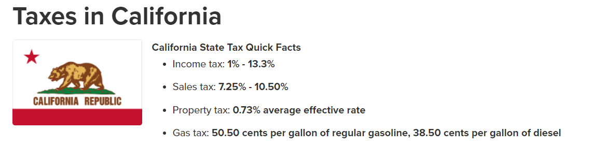</a>

  
 Figure 2: Tax Breakdown for California.[SmartAsset.com].
 

</h4>
<h4 align="center" style="margin-top: 1em; margin-bottom: 3em;">  
 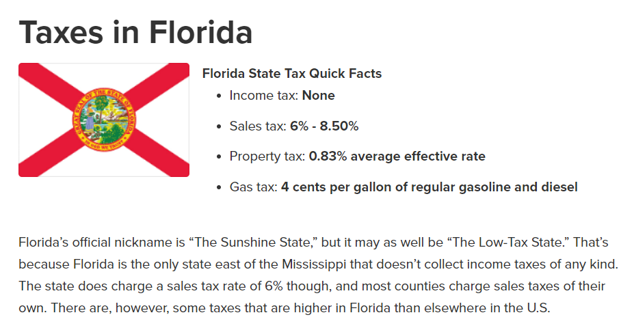</a>

  
 Figure 3: Tax Breakdown for Florida.[SmartAsset.com].
 

</h4>
<h4 align="center" style="margin-top: 1em; margin-bottom: 3em;">
  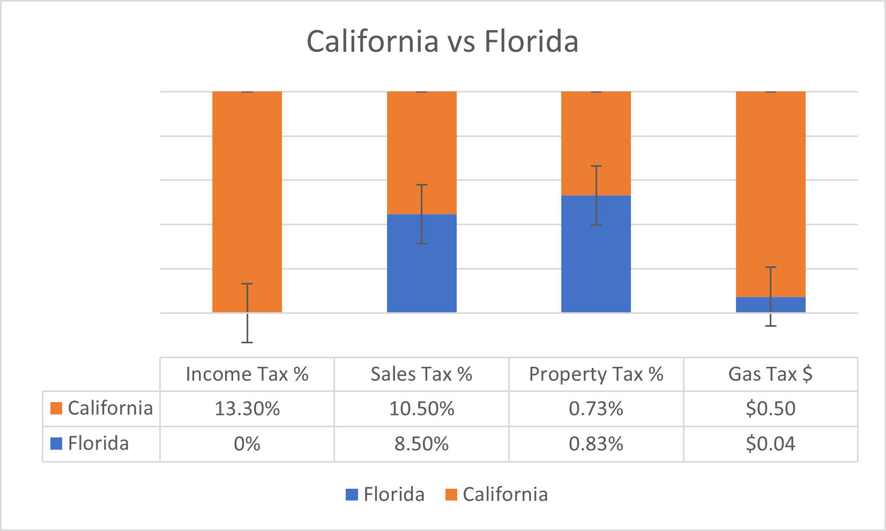</a>

  
 Figure 4: Custom Bar chart with Error Comparison for California and Florida.  The data utilized the top percentages for each state.
 

 </h4>

Over all each state offers their own benefits of living there, with tradeoffs.  SmartAsset.com describes each best: 

"[California](https://smartasset.com/taxes/california-tax-calculator) has among the highest taxes in the nation.  It's base sales tax rate of 7.25% is higher than that of any other state, and its top marginal income tax rate of 13.3% is the highest state income tax rate in the country.  The Golden State fares slightly better where real estate is concerned, though.  The average homeowner pays just 0.73% of their actual home value in estate taxes each year".  Information accessed on August 29, 2021.
 
"Florida's official nickname is the 'Sunshine State,' but it may as well be 'The Low-Tax State.'  That's because Florida is the only state east of the Mississippi that doesn't collect income taxes of any kind.  The state does charge a slaes tax rate of 6% though, and most counties charge sales taxes of their own.  There are, however, some taxes that are higher in [Florida](https://smartasset.com/taxes/florida-tax-calculator) than elsewhere in the U.S.  Information accessed on August 29, 2021. 

<b>3.3 Occupational and Labor Statistics </b>

  The costs of operating a business and paying the employees of said company must drive sales, and innovation to compete in the given sector.  Operating costs, competitive wages, talent, all factor into the equation.  So what makes a state better than the other for computer engineering and technology?  When looking at the United States labor statistics on [BLS.gov](https://www.bls.gov/), useful insights and data had been compiled into useful charts.  Those charts are listed below in the figures for analysis.

 
<h4 align="center" style="margin-top: 1em; margin-bottom: 3em;">
  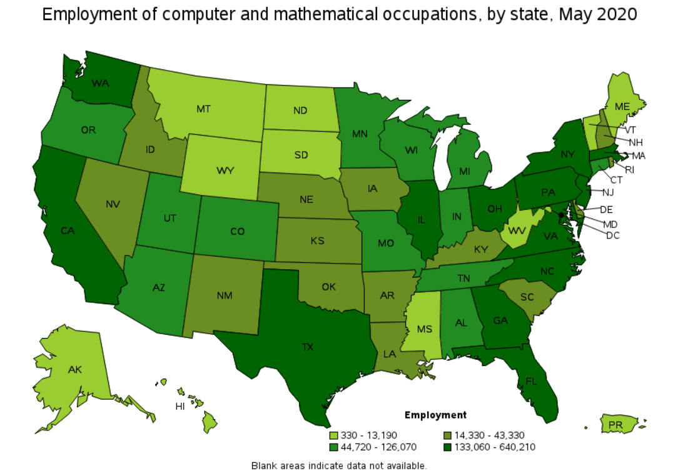

  Figure 5: Employment of Computer Mathematics Occupations, by State, May 2020.[BLS.gov].
 </h4>
 

 As diplayed by Figure 5, both California and Florida each have high levels of employment for Computer 
 and Mathematical Occupations.  With Texas equally weighted according to the figure. 

 
<h4 align="center" style="margin-top: 1em; margin-bottom: 3em;">
  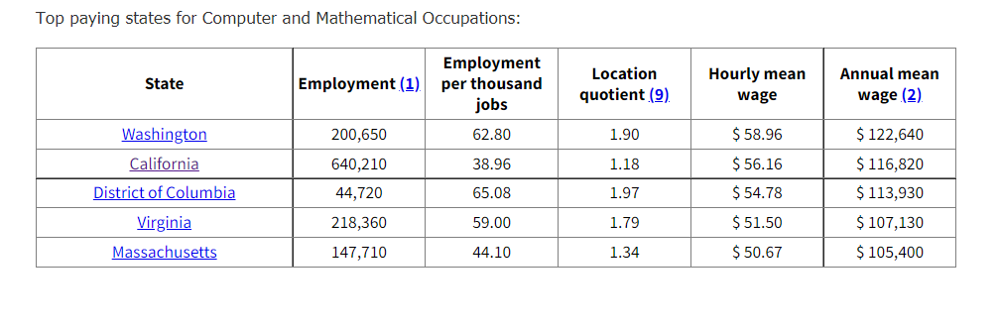</a>

  
 Figure 6: Top Paying States for Computer and Mathematical Occupations.[BLS.gov].
 

 </h4>

 According to Figure 6, the top paying state is Washington state, followed in second by California.  The District of Columbia in third, Virginia in fourth, and Massachusetts in fifth.  Florida is not listed in the top 5 and this is most likely due to the lower cost of living.  As the other states have higher cost of living averages and home prices.

 
 <h4 align="center" style="margin-top: 1em; margin-bottom: 3em;">
 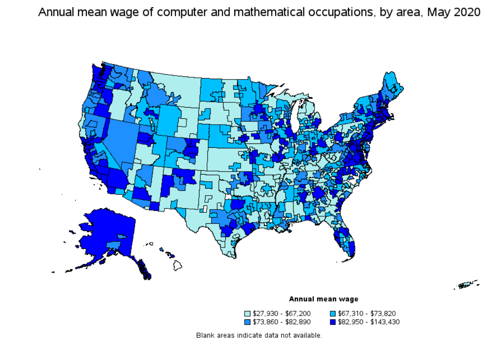</a>

  
 Figure 7: Annual Mean Wage of Computer and Mathematical Occupations, by Area, May 2020. [BLS.gov].
 

</h4>
 
<h4 align="center" style="margin-top: 1em; margin-bottom: 3em;">  
 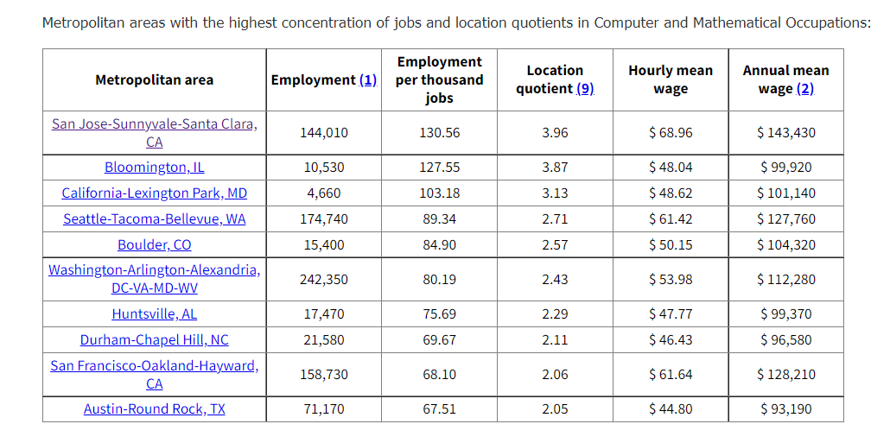</a>

  
 Figure 8: Metropolitan Area with the Hight Concentration of Jobs and Location Quotients in Computer and Mathematical Occupations. [BLS.gov].
 

</h4>

 Figure 7 and 8 contains details regarding employment and annual wage statistics.  As you probably guessed, Santa Clara, in San Jose, CA which is part of Silicon Valley is the number one.  Followed by Bloomington, IL, and California-Lexington Park, MD.  Austin-Round Rock, TX brings in the last spot at an average annual salary of $93,190.  In Figure 7, it can be noted that parts of Florida (to include the Miami-Dade County area) are in dark blue, indicating higher mean annual pay compared with California.

 
  
<h4 align="center" style="margin-top: 1em; margin-bottom: 3em;">
  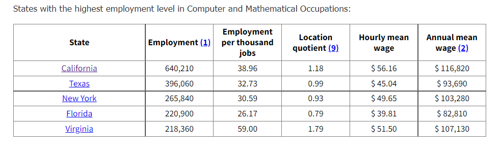</a>

  
 Figure 9: States with the Highest Employment Level in Computer and Mathematical Occupations.[BLS.gov].
 

 </h4>

 In Figure 9, the states with the highest potential for employment in the fields of Computer Mathematical Occupations coincide with what was originally hypothesized, and correlates with the recent moves of many high-tech companies such as Tesla.  California ranks at number one, followed by Texas in second.  Newyork takes third, and Florida is ranked as number four.  Virgina, makes up the fifth spot.  Note the difference in pay, as Florida although number four, has the lowest average annual pay.  It is important to remmember the lower cost of living that factors into that.  

<b>3.4 Business Incentives </b>

Data collected from [apps.csg.org](http://apps.csg.org/BusinessIncentives/Default.aspx).  A state incentives database.  Provided information regarding statistics in population, taxes, and business related initiatives to foster small and larger scale enterprises.  Two were chosen (one from each state) that were considered viable to the data.  Based on initial analysis, and comparing the results collected, when comparing populations of California at 37,253,956 to Florida at 18,801,310 - there is a lot of room for growth in Florida.  Especially when seeing the types of initiatives and attitude each is expressing for growth in technology.

 <b>Small Business Loan Gurantee Program</b>

The [California Small Business Loan Guarantee Program (SBLGP)](http://apps.csg.org/BusinessIncentives/StateProfile.aspx?id=5) is administered by the Business, Transportation and Housing Agency in partnership with the Governor's Office of Economic Development (GoED) and works to help businesses create and retain jobs, while at the same time encouraging investment into low- to moderate-income communities. The SBLGP enables small businesses to not only obtain a loan it could not otherwise obtain, but to establish a favorable credit history with a lender. With that, the business may obtain further loans on its own, without the assistance of the program. Accessed on August 29, 2021.

 <b>New Florida Initiative</b>

Consider the powerful impact of 11 highly productive state universities working together to transform Florida and its economy. This is the [New Florida Initiative](http://apps.csg.org/BusinessIncentives/StateProfile.aspx?id=9). Launched in 2010 in partnership with the Florida’s Governor and Legislature, this multi-year endeavor will ensure that Florida’s knowledge and innovation economy is sustained by high-technology, high-wage jobs in the fields of science, technology, engineering and mathematics (or “STEM”). A true and holistic transformation will also involve the areas of medicine and health care, finance, insurance, professional services, education and the arts, which are the foundation of a modern society. The New Florida Initiative is the State University System’s collaborative effort — alongside business and government — to deliver the economy, talent and innovations that Florida must have to be globally competitive. Accessed on August 29, 2021.

<b>3.5 Crime Statistics</b>

Data provided for the crime statistics report was gathered from multiple sources and was compiled together utilizing Excel, Python, and IBM Watson Studios.  Overall, the varying datasets when reviewed required further cleaning, and did not match up correctly for analysis.  Therefor, it was decided to add supporting charts for analysis from [NeighborhoodScout](https://www.neighborhoodscout.com).

  <h4 align="center" style="margin-top: 1em; margin-bottom: 3em;">
  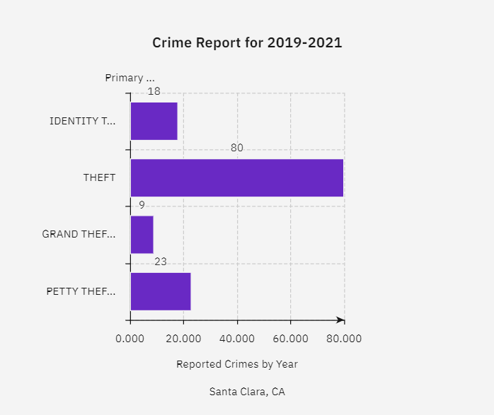

  Figure 10: Historical Crime Report for Santa Clara, CA.  Key="THEFT". [IBM Watson Studios].
 </h4>
 
   <h4 align="center" style="margin-top: 1em; margin-bottom: 3em;">
  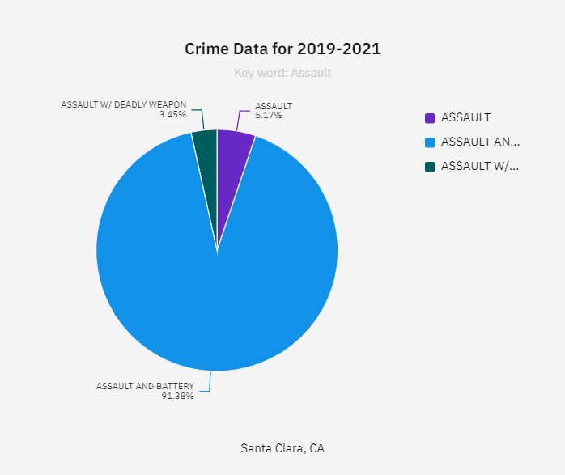

  Figure 11: Historical Crime Report for Santa Clara, CA.  Key="ASSUALT". [IBM Watson Studios].
 </h4>

<h4 align="center" style="margin-top: 1em; margin-bottom: 3em;">
  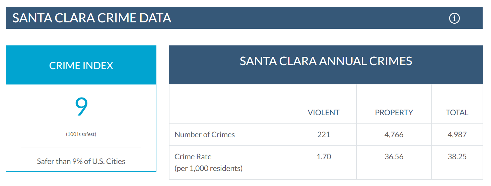

  Figure 12: Santa Clara Crime Report: 2021. [neighborhoodscout.com].
 </h4>
 
 <h4 align="center" style="margin-top: 1em; margin-bottom: 3em;">
  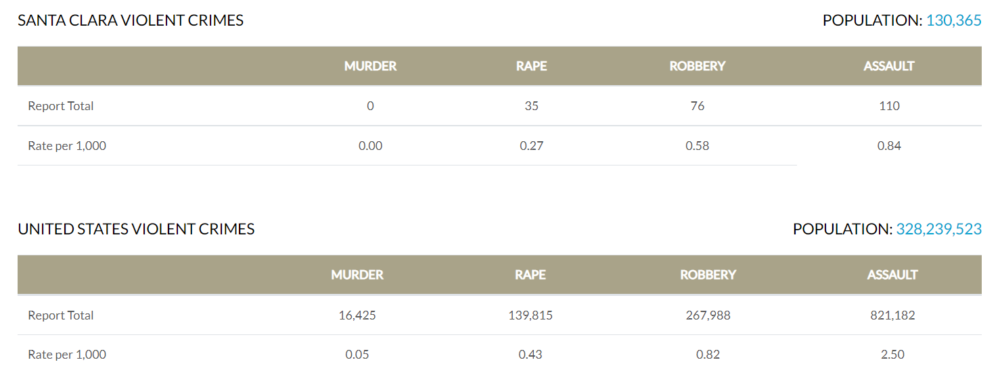

  Figure 13: Santa Clara Violent Crime Report Compared to US Average: 2021. [neighborhoodscout.com].
 </h4>
 
  <h4 align="center" style="margin-top: 1em; margin-bottom: 3em;">
  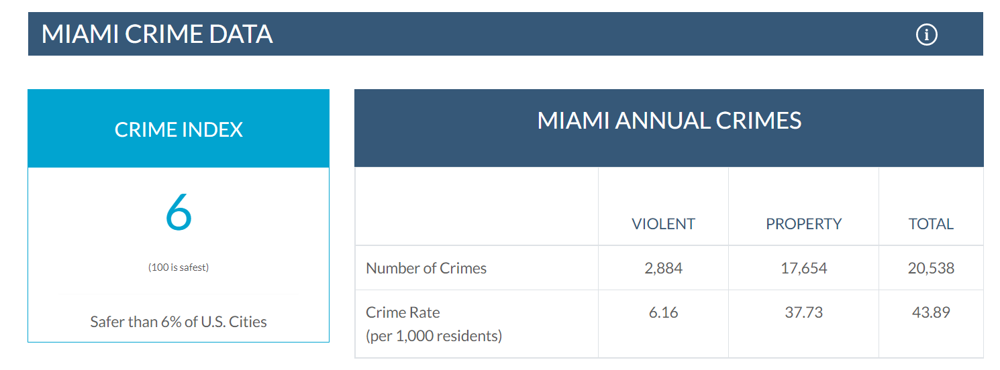

  Figure 14: Miami Crime Report: 2021. [neighborhoodscout.com].
 </h4>
 
  <h4 align="center" style="margin-top: 1em; margin-bottom: 3em;">
  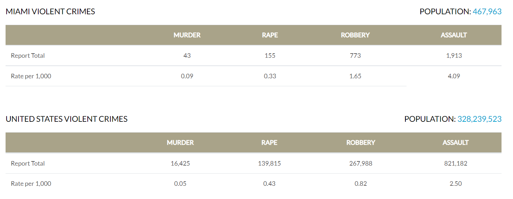

  Figure 15: Miami Violent Crime Report Compared to US Average: 2021. [neighborhoodscout.com].
 </h4>
 
When analyzing the data provided from the crime reports, no major distinctions can be inferred from each state's crime statistics.  They are both quite similar, with Santa Clara scoring a 9% compared to Miami scoring a 6% (out of 100 being the safest).  That is three percent difference in the amount of crime present in both areas.  However, when we look into the details and compare the what types of crime are being committed that is where things are vastly different.

Santa Clara has a population of 130,000 and makes up a higher, upscale area with most crimes being related to theft in Figure 10, and assualt and battery in Figure 11.  Comparing this data with Figures 12 and 13, we can see that there are zero deaths but 36 cases of rape, 76 robberies, and 110 cases of assualt according to annual statistics.  According to NeighborhoodScout "With a crime rate of 38 per one thousand residents, Santa Clara has one of the highest crime rates in America compared to all communities of all sizes - from the smallest towns to the very largest cities. One's chance of becoming a victim of either violent or property crime here is one in 26. Within California, more than 91% of the communities have a lower crime rate than Santa Clara." 

Mimai has a population of 467,963 and thus far has had 2,884 violent crimes and 17,654 property crimes per annual statistics.  As of 2021, there has been 155 cases of rape, 773 cases of robbery, and 1,913 cases of assualt.  According to NeighborhoodScout, "With a crime rate of 44 per one thousand residents, Miami has one of the highest crime rates in America compared to all communities of all sizes - from the smallest towns to the very largest cities. One's chance of becoming a victim of either violent or property crime here is one in 23. Within Florida, more than 90% of the communities have a lower crime rate than Miami."

Conclusion from the crime data gathered, is that it would be best to live outside these metropolitan areas (cities) and live in a smaller, gated coommunity if possible.

<b>3.6 Neighborhood Clustering and Analysis using FourSquare API</b>

 
When exploring what options are available near the city of Miami, Fl data was collected using the [FourSquare API](https://foursquare.com/) and compared with neighboring towns.  As noted earlier, Miami is not the safest city to live in, and while a commute there may cost more money.  There are plenty of safer towns around the Miami-Dade County area that each provide nice benefits similar to California.  Let's begin with a comparison of the two locations: Santa Clara, CA and Miami, FL.

  <h4 align="center" style="margin-top: 1em; margin-bottom: 3em;">
  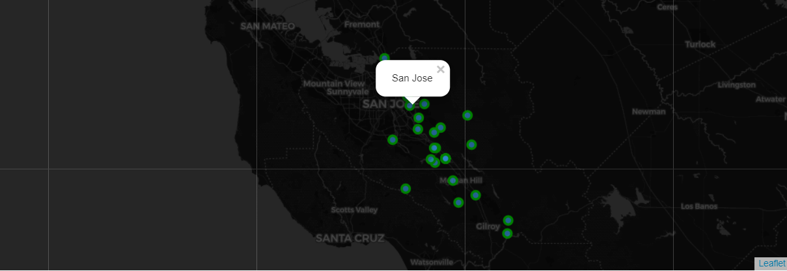

  Figure 16: Map of Santa Clara, San-Jose County Generated Using Folium.
 </h4>
 
  <h4 align="center" style="margin-top: 1em; margin-bottom: 3em;">
  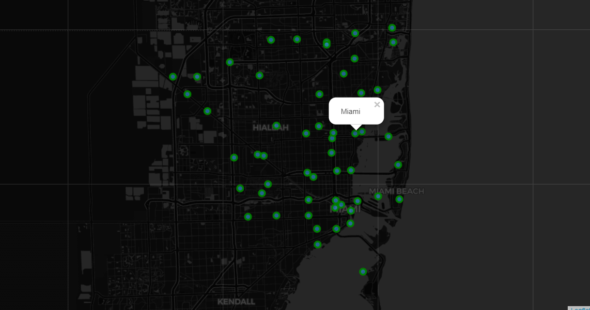

  Figure 17: Map of Miami-Dade County Generated Using Folium.
 </h4>
 
 Now lets look into the dataframe created from Jupyter notebook, grouping Miami and its neighboring towns.
 
   <h4 align="center" style="margin-top: 1em; margin-bottom: 3em;">
  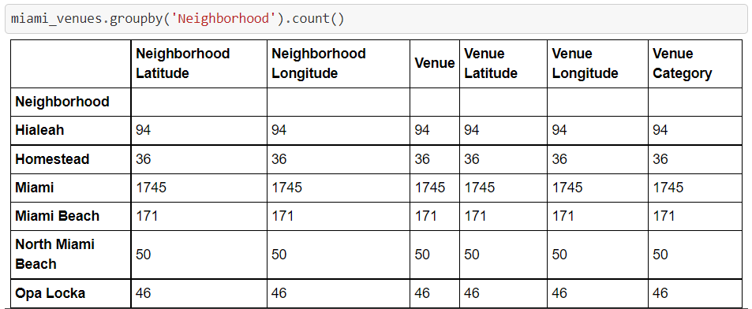

  Figure 18: Dataframe of Miami and Local Neighborhoods.
 </h4>
 
As we can see here, there are a total of areas in the proximity set by the geodata in Miami-Dade County.  Each row lists the number of venues reported by FourSquare.

   <h4 align="center" style="margin-top: 1em; margin-bottom: 3em;">
  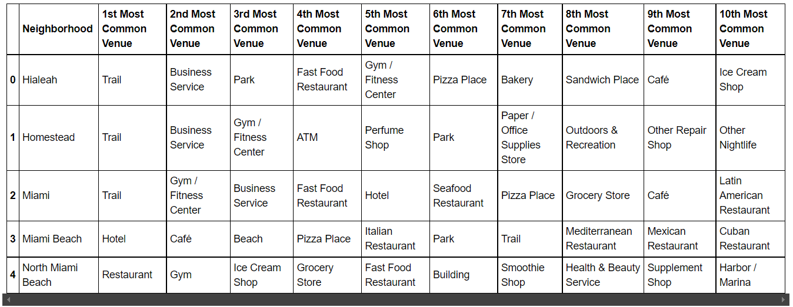

  Figure 19: Dataframe of Most Common Venues in Miami Area.
 </h4>
 
 Upon review of the data, there were 6 towns/cities in the Miami area, with 2,142 different venues, and 256 unique categories to explore.  Of the five clusters created from the data: 

Cluster 1 contains mostly restaurants and convenience stores.  
Cluster 2 is has gyms and other outdoor related activities.  
Cluster 3 has a variety of fitness, outdoor, and city-life activities.  
Cluster 4 has restaurants and small shops.  
Cluster 5 has hotels, cafe's and beach realestate to explore.

<b>4.0 Conclusions </b>

After exploring each of the different variables associated with California and Florida provided in this report, the following summarize the two locations:
1. Weather: Both share beautiful warm weather and coastal beaches.  However, if desert, dry, low-humidity is your thing then stay in California.  If not, and you do not mind rain and humidity then Florida will satisfy you.
2. Business and Expansion: Currently Florida is the clear winner with lower population, a STEM focused business initiative, and competitive wages for the Computer Mathematical Occupations field.  Pair that with lower taxes and no income tax means your dollar will go further, and business growth can remain in Florida which is good for their economy.
3. Crime: Both Santa Clara, CA and Miami, FL are not safe for families or a quiet life.  However, Santa Clara is marginally safer by 3%.  It is recommended to live in a smaller town/area on the outskirts of both cities and make a commute to work.

<b>5.0 Future Directions </b>

There will be a huge shift of continued movement out of California in the next few years.  Continued government overreach, high taxes, and rising unemoployment in major cities (North Western/North Eastern) will see and influx into the midwest and south east states.  We could possibly end up seeing a major shift in locations of technical institutes and funding, as research and talent moves elsewhere.  Even with remote working conditions due to COVID-19 will subside, as things eventually reopen and people try to live their lives normally.  The prospects of a lower-cost of living, relaxed atmostphere, and less government restrictions will setup certain states for expansion in the STEM fields and the states who don't adapt will fall behind.  Additional data that would be beneificial to see with the analysis would be to supplement the transportation and census data for compare and contrast over the next 5 to 10 years.

