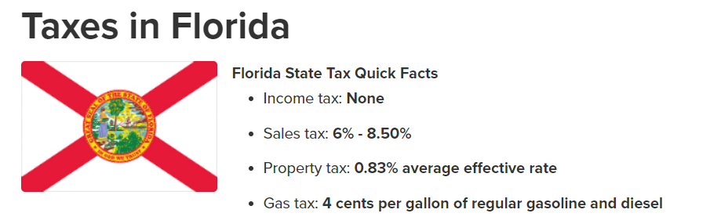

<h1 align="center" style="margin-top: 1em; margin-bottom: 3em;">
</h1>
<h2 align="center" style= "margin-top: 1em; margin-bottom: 3em;"> Project Title: "The New Silicon Valley: 
 
Why Miami is the New Hotspot for Tech Innovation." </h2> 

 
 <h4 align="center"> By: Goose0x 
 Date: August 29, 2021 </h4> 

<b>1.0 Introduction </b>

<b>1.1 Background </b>

The results of the COVID-19 pandemic have put a major strain on businesses due to government policies, paired with a rising income tax rate, and high cost-of-living.  As a result many businesses are looking for alternative places to setup, or move to.  This year we are seeing that many major key players in the tech industry are looking for alternative locations and local governments who support entrepreneurs and businesses to support the goals of the company. 

This is a major shift again in history (like the gold rush in the mid 1800's, and Silicon Valley in the early 1900s to today) now seeking less government restriction elsewhere for booming technical innovation, lower crime rate, and better living conditions.  Which could also bring in more people and money to the cities. 

For the Capstone Project I will be investigating why tech businesses are choosing to move to Miami versus staying in Silicon Valley, San Francisco Bay, CA. and Why places like Miami, FL and Austin, TX are so attractive? 

<b>1.2 Problem </b>

 
This poses a unique situation for California, adapt or lose business.  The data collected will be the average cost of living for each location, income tax and other tax for each area. 

Average cost of labor, and business related incentives that make comparisons of the two states.  The report will also discuss the crime rate statistics, environmental factors and attractions 
 
to include local restaurants, housing areas, etc using FourSquare API data.

  
<b> 1.3 Interest </b>

This information, compiled into a report would be beneficial for businesses looking to expand or move to alternative locations in order to maintain business in the United States and avoid high taxes, overcrowded cities, and look for suitable places their business and families can grow.  The report features a breakdown of the categories with supported documentation amd statistical analysis through tables.

  
<b>2.0 Data Acquisition and Cleaning </b>

<b>2.1 Data Sources </b>

Data for comparison was collected from a variety of sources.  At some locations it was able to be utilized as is.  For others, it would require further analysis and cleansing. 

The zipcodes geodata for [California GeoData](<https://www.geonames.org/postalcode-search.html?q=california&country=US>) and for [Florida GeoData](<https://www.geonames.org/postalcode-search.html?q=florida&country=US>). 

Cost of living data was collected here [Cost of Living Comparison](<https://www.bestplaces.net/cost-of-living/santa-clara-ca/miami-fl/250000>). 

Income Taxes and Other Taxes for [California Income Tax](<https://smartasset.com/taxes/california-tax-calculator>)and for [Florida Income Tax](<https://smartasset.com/taxes/florida-tax-calculator>). 

Occupational and Labor Statistics were downloaded from here [California Labor](<https://www.bls.gov/oes/current/oes_ca.htm#15-0000>) and for [Florida Labor](<https://www.bls.gov/oes/current/oes_fl.htm#15-0000>). 
 
Business Incentives for comparing the states were from here [California Business](<http://apps.csg.org/BusinessIncentives/StateProfile.aspx?id=5>) and for [Florida Business](<http://apps.csg.org/BusinessIncentives/StateProfile.aspx?id=9>). 

Crime statistics for each state were collected from here [Santa Clara County, CA](<https://www.santaclaraca.gov/our-city/departments-g-z/police-department/crime>) and from [Miami-Dade County, FL](<https://www.miamidade.gov/global/police/crime-statistics.page>). 

  
 <b>2.2 Data Cleaning </b>

  
 <b>2.2.1 Geolocation Data</b>

 The geolocation data was webscraped using beautiful soup and was exported as a txt file.  The file was then compiled and cleaned utilizing IBM Watson Studios.
 Compiled into this [CSV](<https://github.com/Goose0x/Coursera_Capstone/blob/master/CSV/zip_codes_cal_fl.csv>).

 Initial issues with the data collection posed problems, as locating sufficient data, cleaning it, and getting the values to correctly display posed a problem when utilizing GeoLocator with Python.  Once the data had been collected, and properly formatted into a text file.
 
 The tools provided within IBM Watson Studios made the task of cleaning, organizing, removing, and sorting easy.  
 Once the data was imported, a flow was created to <i> Filter </i> only "Santa Clara" + "Miami-Dade". 

 The data then was verified and "Na" values were present in the data set under "Latitude" and "Longitude".  This was cleaned with a <i> Remove </i> operation.
 The data was verified again for any "Na" values using .isnull. 

 The dataset was then imported into the Jupyter notebook as part of the Data section, which lists the zipcodes and geo data for Santa Clara County, CA and Miami-Dade County, FL. The dataset was further broken into two dataframes, Santa Clara and Miami. 

 This dataset was used for FourSquare's API to review local data in the Miami, FL vicinity. 

 
  <b>2.2.2 Crime Statistics Data Data</b>

 Crime statistics were collected from the their respective sources and cleaned manually before being processed in IBM Watson Studios data refining process.  The data for Santa Clara was manually edited in Excel to remove unneccessary data points, and refiltered to remove the timestamp as it was proving difficult to clean the data for presentation, and no utilitiy seemed to work while utilizing IBM Watson Studios data refining.  Once the dataset was prepared, it was reimported into IBM Watson Studios for processing.  There were 144,992 total entries.  Data was filtered using "THEFT" and "ASSAULT".  The Miami-Dade County data set was first processed in Excel, to remove unnecessary data, and move selected data "Dates" and "Miami-Dade County" to a new excel document, consisting of years 2015-2019.  Next, it was imported into IBM Watson Studios for processing.  The data sets are located [here](<https://github.com/Goose0x/Coursera_Capstone/tree/master/CSV>).

 To support the data from the crime statistics, data was also accessed from [Neighborhood Scout](<https://www.neighborhoodscout.com/>) for each city.
 
  <b>2.2.3 Labor Statistics Data</b>
 The data chosen for the labor statisctics data proved to be not valid for the report and was discarded after multiple attempts to filter and clean it.  Instead utilizing the website at [BLS.gov](<https://www.bls.gov/>).  A search was conducted for "San-Jose, CA" and "Miami, FL" utilizing the criteria "Computer and Mathematical Occupations".

 Utilizing these parameters data was collected and tables created to display a comparison of the data.  The files can be located [here](<https://github.com/Goose0x/Coursera_Capstone/tree/master/Images>). 

 
 <b>3.0 Exploratory Data Analysis </b>

 
 <b>3.1 Cost of Living Comparison </b>
 When considering a new location to live many factors play into what the cost will be to live in that area.  That is why it was important to look into a comparison of the data between Santa Clara, CA and Miami, Florida.
<h1 align="center" style="margin-top: 1em; margin-bottom: 3em;">
 </a>

</h4>

<h4 align="center" style="margin-top: 1em; margin-bottom: 3em;">
 
 Figure 1: Cost of Living Comparision for Santa Clara, CA and Miami, FL.
</h4>

  
 Overall we can see that there is a major difference in Housing at 74.5% less which makes up the Homeowner median housing index.  The average home in Santa Clara, CA is $1,292,200   compared to a house in Miami, FL at $329,900.  Thats a difference of over $962,300.  The other categories like Food and Grocery, Utilities, and Transportation are comparable and   are not a focus of this figure.
 

 <b>3.2 Income Taxes and Other Associated Taxes </b>
 

  Anyone who works hard wants to keep their money, and it is important to factor in what the state you are working in, is taking out from your paycheck.  The next figure compares California and Florida income tax, and associated taxes with property and gas.
 

  
<h1 align="center" style="margin-top: 1em; margin-bottom: 3em;">
 </a>

  </a>

</h4>
<h1 align="center" style="margin-top: 1em; margin-bottom: 3em;">
  </a>

</h4>

<h4 align="center" style="margin-top: 1em; margin-bottom: 3em;">
 
 Figure 1: Cost of Living Comparision for Santa Clara, CA and Miami, FL.
</h4>

 
 
  
  
  
  
  
  
  
  
  
  
  
  
  
  
  
  
  

.
